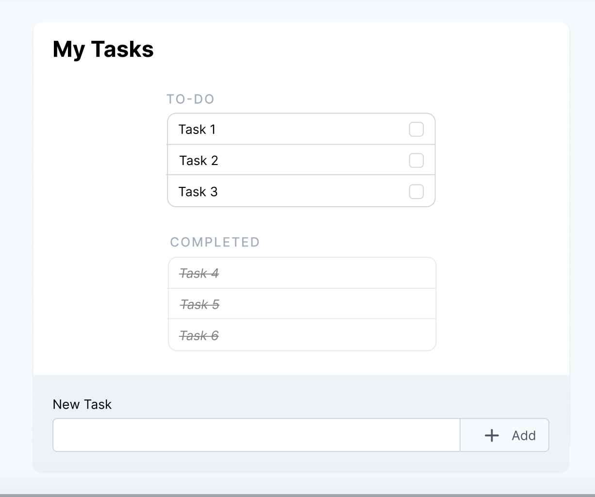

# To-Do App

[https://github.com/cmurray21/tall-stack-app](https://github.com/cmurray21/tall-stack-app)

This was my first time using the TALL (Tailwinds, Alpine.js, Laravel, Livewire) Stack. There was a bit of a learning curve, but once I started learning more about the different layers of the stack, I started to see the bigger picture of what developing with these tools might look like.



I was tasked with creating a ToDo App and given this UI Mockup as a guideline. In order to get started, I needed a Laravel environment. I was able to quickly create a new Laravel app and add the TALL components with only a couple lines in the terminal.  

I followed a livewire intro tutorial to create a very basic interactive component: a counter. I used the [quickstart tutorial](https://laravel-livewire.com/docs/2.x/quickstart) to get acquainted with how livewire extends Laravel's capabilties. 

I also reviewed the Tailwinds and Alpine.js docs.

With a quick introduction to the different parts of the stack, I was ready to start working on this project. 

I work best when I can learn from example and see how things work so I found a couple examples that used the TALL stack. These were really helpful for connecting the dots. My work ended up as a blend of elements from these approaches. Here are some links showing original code:

- [https://codepen.io/ryangjchandler/pen/qBOEgjg](https://codepen.io/ryangjchandler/pen/qBOEgjg)
- [https://scrimba.com/learn/alpinejs/todo-app-and-x-model-cZPQM9h6](https://scrimba.com/learn/alpinejs/todo-app-and-x-model-cZPQM9h6)
- [https://gist.github.com/lukaszmn/0f293fc398f2bb1a9d9e6a77c003916c](https://gist.github.com/lukaszmn/0f293fc398f2bb1a9d9e6a77c003916c)

These examples were very helpful for understanding the utility-based Tailwinds. I learned how Alpine uses "**x-model**" to create two-way binding. This allowed me to add tasks using both the text input box with the enter key and the add button while avoiding unexpected results. 

There were a few areas were my implementation differed from the wireframe mockup. Most notably was the lack of a separate task list for **completed** items. I don't have a lot of frontend JS/dom manipulation experience so I struggled here, a little. There were also some spacing and alignment issues. I played with this for quite some time, but ultimately I thought it was more important to submit the functional product.

It was a lot of fun learning about these new tools. I tried to get a demo deployed but was not successful using a digital ocean LEMP droplet nor with Laravel Forge. Previously I have used apache so I may have made some mistakes configuring the server with Nginx. 

I will keep trying to solve these issues, but with the clock ticking I wanted to submit the code and at least communicate where I am with the project. With that in mind, I made a quick little screencast and uploaded it to YouTube so you can see the code in action without necessarily cloning the repo.

[https://www.youtube.com/watch?v=B1JZrmHFVQ4](https://www.youtube.com/watch?v=B1JZrmHFVQ4)

### tall-stack-app/resources/views/welcome.blade.php

```php
@extends('layouts.app')

@section('content')

@livewire('task')

@endsection
```

### tall-stack-app/resources/views/livewire/task.blade.php

```php
<body class="bg-gray-200 text-gray-700">
    <div class="container mx-auto max-w-md px-4 my-4" x-data="todos()">
        <div class="bg-white shadow-lg rounded px-6 py-4">
            <p class="text-4xl">My Tasks</p>
            <ul class="mb-6 rounded border-2 border-gray-100 divide-y divide-solid space-y-2">
                <template x-for="todo in todos" :key="todo.id">
                    <li class="flex w-full justify-between">
                        <div class="flex w-full" :class="{ 'line-through' : todo.isComplete }">
                            <div class="ml-2 py-2 px-2" x-text="todo.title"></div>
                        </div>
                        <input class="form-checkbox h-6 w-6 text-indigo-600" type="checkbox" x-model="todo.isComplete">
                    </li>
                 </div>
                </div>
              </template>
             </ul>
         </div>
    <br> New task:
    <br>
    <div class="flex w-full">

        <input type="text" class="shadow-lg w-xl px-2 py-2" x-model="todoTitle" @keydown.enter="addTodo()">
        <button class="bg-gray-300 hover:bg-gray-400 text-gray-800 font-bold py-2 px-2 rounded" x-model="todoTitle"
            @click="addTodo()"> Add + </button>

        </div>
    </div>

    <script>
        function todos() {
            return {
                todos: [{
                        id: 1,
                        title: 'Task 1',
                        isComplete: false,
                    },
                    {
                        id: 2,
                        title: 'Task 2',
                        isComplete: false,
                    },
                    {
                        id: 3,
                        title: 'Task 3',
                        isComplete: false,
                    }
                ],
                todoTitle: '',
                todoId: 4,
                addTodo() {
                    if (this.todoTitle.trim() === '') {
                        return;
                    }
                    this.todos.push({
                        id: this.todoId,
                        title: this.todoTitle,
                        isComplete: false,
                    })
                    this.todoId++;
                    this.todoTitle = '';
                },
            }
        }
    </script>
```